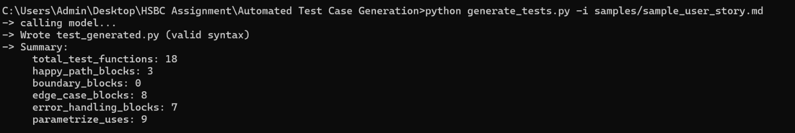
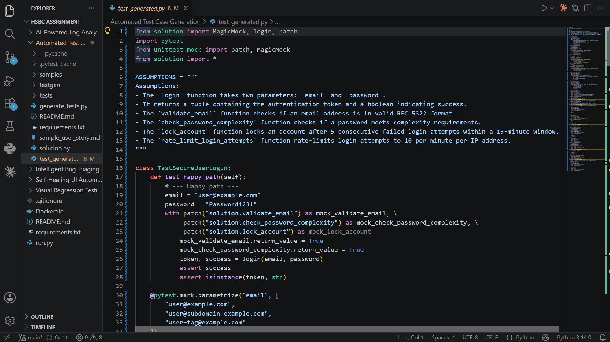

# Automated Test Case Generation

> **AI-powered PyTest suite generation from user stories — runs entirely on your laptop with local Ollama. No API keys. No cloud. No cost.**

---

## What It Does

Given a user story or acceptance-criteria document (Markdown or plain text), this tool:

1. **Extracts** every acceptance criterion (numbered items) from the story
2. **Generates** a complete PyTest test module with:
   - Happy-path tests for every criterion
   - Boundary Value Analysis (BVA) for every numeric/length constraint
   - Equivalence Partitioning for categorical inputs
   - Edge cases: `None`, empty string, unicode, very large input
   - Error-path tests (`pytest.raises`) for rejection scenarios
3. **Self-heals** syntax errors by feeding them back to the model (up to 2 retries)
4. **Auto-batches** large stories (>10 criteria) into groups, then merges with an AST-based merger
5. **Optionally generates** a minimal `solution.py` stub scaffold so pytest can collect the suite immediately

---

## Architecture

```
User Story (.md/.txt)
        │
        ▼
┌─────────────────┐
│  testgen.parser │  ← Extracts preamble + numbered AC items
└────────┬────────┘
         │
    ┌────┴────────────────────────────┐
    │  Single story (≤10 items)       │  Large story (>10 items)
    │  testgen.generator.single_shot  │  testgen.generator.batched
    └────────────────────────────────┘
              │                │
              ▼                ▼
    ┌──────────────────────────────────┐
    │   testgen.ollama_client          │  ← Streaming Ollama HTTP client
    │   (retry + exponential backoff)  │     with per-token read timeout
    └──────────────────────────────────┘
              │
              ▼
    ┌──────────────────────────────────┐
    │   testgen.output                 │  ← Extract code, validate with ast.parse
    │   (extract → validate → heal)    │     Self-heal on SyntaxError
    └──────────────────────────────────┘
              │
         (batched only)
              ▼
    ┌──────────────────────────────────┐
    │   testgen.merge                  │  ← AST-based de-dup & rename
    └──────────────────────────────────┘
              │
              ▼
     test_generated.py  +  solution.py (optional)
```

---

## Quick Start

```bash
# 1. Start Ollama (if not already running)
ollama serve
ollama pull qwen2.5-coder:7b        # recommended for code generation

# 2. Install dependencies
pip install -r requirements.txt

# 3. Generate tests from a user story
python generate_tests.py -i samples/sample_user_story.md

# 4. Generate tests + a solution stub, then verify with pytest
python generate_tests.py -i samples/sample_user_story.md --with-stub --verify

# 5. Generate from a large story (auto-batches)
python generate_tests.py -i samples/sample_user_story_large.md
```

---

## CLI Reference

| Flag | Default | Description |
|---|---|---|
| `-i / --input` | *(required)* | Path to user story / acceptance-criteria file |
| `-o / --output` | `test_generated.py` | Output PyTest file path |
| `-m / --model` | `llama3.1` | Ollama model name |
| `--host` | `http://localhost:11434` | Ollama server URL |
| `--temperature` | `0.2` | Sampling temperature (lower = more deterministic) |
| `--num-ctx` | `8192` | Context window size in tokens |
| `--read-timeout` | `60` | Seconds between streamed tokens before treating as stall |
| `--max-retries` | `2` | Self-healing retry budget per batch on syntax errors |
| `--batch-size` | `8` | Max acceptance criteria per batch |
| `--batch-threshold` | `10` | Switch to batch mode above this many criteria |
| `--no-batch` | off | Force single-shot even for large stories |
| `--force-batch` | off | Force batch mode even for small stories |
| `--verify` | off | Run `pytest --collect-only` after writing the file |
| `--with-stub` | off | Also generate a minimal `solution.py` stub scaffold |

---

## Recommended Models

| Model | Size | Best For |
|---|---|---|
| `qwen2.5-coder:7b` | ~4.7 GB | Best overall test quality |
| `deepseek-coder-v2:16b` | ~9 GB | Complex multi-file codebases |
| `llama3.1` | ~4.7 GB | General purpose, good balance |
| `llama3.2:3b` | ~2 GB | Fast CI environments, lower quality |
| `codellama:7b` | ~3.8 GB | Strong Python code focus |

---

## Project Structure

```
Automated Test Case Generation/
├── generate_tests.py         # Thin entry-point (imports from testgen/)
├── requirements.txt
├── README.md
├── samples/
│   ├── sample_user_story.md           # Secure login story (8 criteria)
│   └── sample_user_story_large.md    # International transfer story (17 criteria)
├── tests/
│   ├── test_parser.py    # Unit tests for acceptance-criteria extraction & chunking
│   └── test_merge.py     # Unit tests for AST-based batch merger
└── testgen/                 # Core package
    ├── __init__.py
    ├── constants.py         # ALL magic strings / numeric defaults
    ├── config.py            # CLI configuration dataclass
    ├── prompts.py           # System/user/batch/fix/stub prompt templates
    ├── ollama_client.py     # Streaming Ollama HTTP client with retry/backoff
    ├── parser.py            # Acceptance-criteria extraction & chunking
    ├── generator.py         # Single-shot, batched & stub generation pipelines
    ├── merge.py             # AST-based multi-batch module merger
    └── output.py            # Code extraction, syntax validation & summarisation
```

---

## Key Enhancement Features

| Feature | Description |
|---|---|
| **Auto batch mode** | Stories with >10 numbered criteria are split automatically; batches merged with AST de-duplication |
| **Self-healing generation** | Syntax errors are fed back to the model with error details; retried up to `--max-retries` times |
| **In-session caching** | Batch 1's ASSUMPTIONS docstring is extracted and passed to later batches to keep API signatures consistent |
| **Streaming timeout** | Read timeout applies per-token (not per-request), preventing false timeouts on slow hardware |
| **Stub generation** | `--with-stub` produces a `solution.py` where every function raises `NotImplementedError`, making the suite immediately collectable |
| `constants.py` | All default values in one file — change model, thresholds, or URL without touching core logic |

---

## Troubleshooting

| Symptom | Fix |
|---|---|
| `Could not reach Ollama` | Run `ollama serve` in a separate terminal |
| `Model not found` | Run `ollama pull <model-name>` |
| `read timeout` after tokens | Increase `--read-timeout` or use a smaller model |
| Tests import-fail (`ModuleNotFoundError: solution`) | Run with `--with-stub` to generate the scaffold |
| Batch merge produces duplicate functions | Function names include a `__b<n>` suffix — rename them after review |

---

## Execution Evidence

1. **Ollama Setup — Pull Code Model (`ollama pull qwen2.5-coder:7b`)**
   

2. **Test Generation Run — Output Summary (18 test functions written)**
   

3. **Generated Test File (`test_generated.py`) opened in VS Code**
   