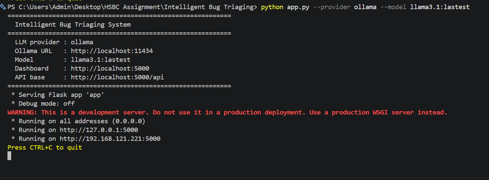
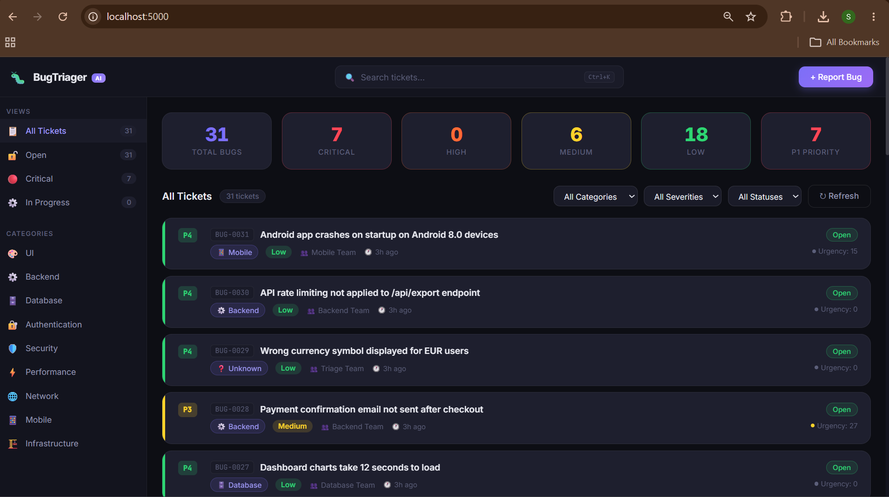
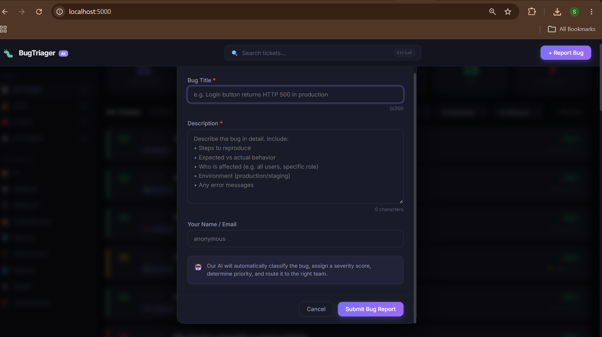
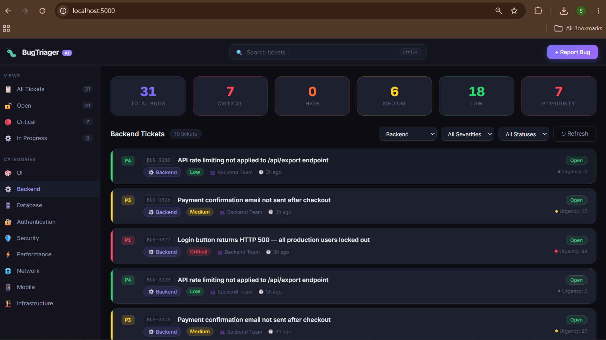
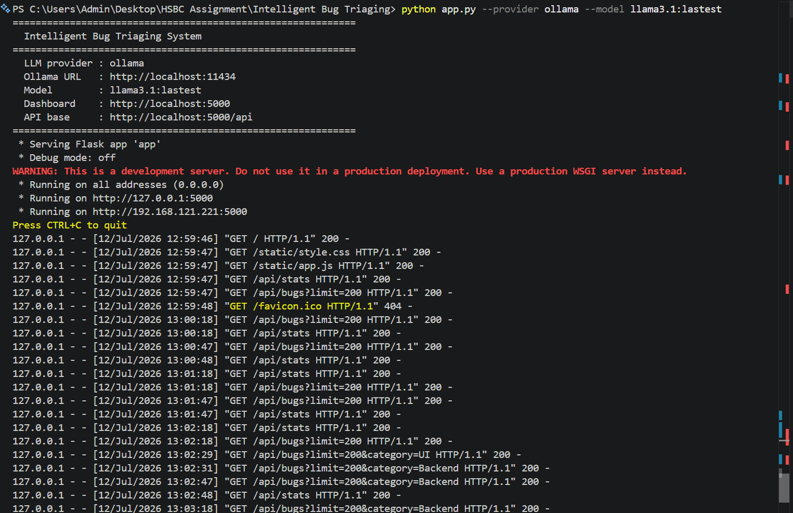

# Intelligent Bug Triaging

> **AI-powered bug triaging with a web dashboard, REST API, SQLite persistence, and duplicate detection — runs locally with Ollama. No cloud. No API key.**

---

## What It Does

Accepts raw bug reports (title + description) and automatically:

1. **Categorises** each bug into one of 9 engineering domains (UI, Backend, Database, Authentication, Security, Performance, Network, Mobile, Infrastructure)
2. **Assigns severity** (Critical / High / Medium / Low) and **priority** (P1–P4) using keyword heuristics + LLM analysis
3. **Routes** the ticket to the correct engineering team
4. **Detects duplicates** — new bugs similar to existing open tickets are flagged and linked
5. **Generates** a plain-English summary and actionable investigation suggestion
6. **Persists** everything to SQLite with a full audit trail

The triaging pipeline is always available: heuristics run first (zero latency), then the LLM enriches the result if Ollama is running.

---

## Architecture

```
 POST /api/bugs (JSON body)
         │
         ▼
 ┌─────────────────────┐
 │   BugReport model   │  raw title + description
 └────────┬────────────┘
          │
          ▼
 ┌─────────────────────────────┐
 │  Phase 1: Heuristics        │  Always runs — zero latency
 │  services/heuristics.py     │  keyword → category, urgency, severity
 └────────┬────────────────────┘
          │
          ▼
 ┌─────────────────────────────┐
 │  Phase 2: LLM Enrichment    │  Optional — requires Ollama
 │  services/llm_clients.py    │  OllamaClient / OpenAICompatClient
 └────────┬────────────────────┘
          │
          ▼
 ┌─────────────────────────────┐
 │  Duplicate Detection        │  TF-IDF fuzzy similarity against open tickets
 └────────┬────────────────────┘
          │
          ▼
 ┌─────────────────────────────┐
 │  TicketDB (SQLite)          │  CRUD + full-text search
 └────────┬────────────────────┘
          │
          ▼
   Dashboard (GET /)  +  REST API (/api/bugs)
```

---

## Quick Start

```bash
# Option A: Heuristic-only mode (no LLM needed)
python app.py --provider none

# Option B: With local Ollama (recommended)
ollama serve
ollama pull llama3.1
python app.py --provider ollama --model llama3.1

# Option C: With OpenAI-compatible API
python app.py --provider openai --api-base https://api.openai.com/v1 \
              --api-key $OPENAI_API_KEY --model gpt-4o-mini

# Open the dashboard
open http://localhost:5000
```

---

## REST API Reference

| Method | Path | Description |
|---|---|---|
| `POST` | `/api/bugs` | Submit a bug report for triaging |
| `GET` | `/api/bugs` | List all tickets (filterable, paginated) |
| `GET` | `/api/bugs/<id>` | Retrieve a single ticket |
| `PATCH` | `/api/bugs/<id>` | Update ticket fields (status, priority, etc.) |
| `DELETE` | `/api/bugs/<id>` | Delete a ticket |
| `GET` | `/api/bugs/search?q=` | Full-text search across all tickets |
| `GET` | `/api/stats` | Dashboard statistics (counts by category/severity) |
| `GET` | `/api/health` | Health check with LLM provider status |

### Submit a Bug

```bash
curl -X POST http://localhost:5000/api/bugs \
  -H "Content-Type: application/json" \
  -d '{
    "title": "Payment gateway returns 500 on checkout",
    "description": "All users on production are unable to complete purchases. The gateway is returning HTTP 500 after 3 seconds. Started 10 minutes ago.",
    "submitter": "ops-team"
  }'
```

### Response

```json
{
  "ticket": {
    "id": 42,
    "bug_id": "BUG-0042",
    "category": "Backend",
    "severity": "Critical",
    "priority": "P1",
    "assigned_team": "Backend Team",
    "confidence": 90,
    "urgency_score": 73,
    "urgency_level": "Critical",
    "summary": "Payment gateway is returning HTTP 500 errors affecting all users on production.",
    "suggested_fix": "Check the payment gateway service logs and health endpoint. Review recent deployments.",
    "analysis_source": "LLM (llama3.1)",
    "status": "Open"
  },
  "is_duplicate": false
}
```

### Filter Tickets

```bash
# By severity
GET /api/bugs?severity=Critical&status=Open

# By category + priority
GET /api/bugs?category=Security&priority=P1

# Full-text search
GET /api/bugs/search?q=login+failure
```

---

## CLI Reference

| Flag | Default | Description |
|---|---|---|
| `--provider` | `ollama` | LLM backend: `ollama`, `openai`, or `none` |
| `--model` | `llama3.1` | Model name |
| `--ollama-url` | `http://localhost:11434` | Ollama server URL |
| `--api-base` | — | OpenAI-compatible API base URL |
| `--api-key` | `$OPENAI_API_KEY` | API authentication key |
| `--port` | `5000` | Flask server port |
| `--host` | `0.0.0.0` | Flask server host |
| `--db` | `bugs.db` | SQLite database path |
| `--debug` | off | Enable Flask debug mode |

---

## Project Structure

```
Intelligent Bug Triaging/
├── app.py                   # Flask app factory + all route handlers
├── database.py              # TicketDB — SQLite CRUD + search + stats
├── triaging_engine.py       # TriagingEngine — orchestrates heuristics + LLM
├── models.py                # BugReport + Ticket dataclasses
├── config.py                # Application configuration
├── requirements.txt
├── sample_bugs.json         # Sample bugs for testing the API
├── seed_bugs.py             # Seeds the database with sample data
├── test_triaging.py         # Integration tests for the triaging pipeline
│
├── domain/                  # Domain layer (new package structure)
│   ├── models.py            # Re-exports BugReport, Ticket
│   └── constants.py         # ALL categories, severities, team mappings
│
├── repositories/            # Data access layer
│   ├── ticket_repository.py # Re-exports TicketDB as TicketRepository
│
├── services/                # Business logic layer
│   ├── heuristics.py        # Keyword-based category/urgency/severity scoring
│   ├── llm_clients.py       # OllamaClient + OpenAICompatClient with docstrings
│   └── triage_service.py    # High-level triaging orchestration adapter
│
├── api/                     # API layer
│   ├── routes.py            # Flask route adapter
│   └── errors.py            # Standardized JSON error response helpers
│
├── templates/
│   └── index.html           # Dashboard HTML template
└── static/                  # Dashboard CSS/JS assets
```

---

## Key Enhancement Features

| Feature | Description |
|---|---|
| **Two-phase triage** | Heuristics always run first (instant, no dependencies); LLM enriches on top when available |
| **Heuristic fallback** | If Ollama is unreachable, triage still produces complete results with confidence scoring |
| **Duplicate detection** | TF-IDF similarity matching against all open tickets, linked on the ticket and dashboard |
| **Urgency scoring** | 0–100 keyword urgency score separate from severity (e.g. "production down" → 73 urgency) |
| **`domain/constants.py`** | All categories, team mappings, severity thresholds in one place |
| **`services/heuristics.py`** | Fully documented keyword dictionaries for all 9 categories |
| **`api/errors.py`** | Standardized error envelope for consistent API client error handling |
| **CORS enabled** | All endpoints allow cross-origin requests for frontend flexibility |

---

## Troubleshooting

| Symptom | Fix |
|---|---|
| Dashboard shows blank | Run `python seed_bugs.py` to populate sample data |
| `provider=ollama` — no AI fields | Run `ollama serve && ollama pull llama3.1` |
| Port 5000 already in use | Run with `--port 5001` |
| All bugs get severity=Unknown | The model response was empty; check Ollama is running |

---

## Execution Evidence

1. **Unit & Integration Test Execution (`pytest test_triaging.py -v`)**
   

2. **Flask Server Startup (`python app.py --provider ollama --model llama3.1`)**
   

3. **Live Web Dashboard (Ticket list with urgencies & severities)**
   

4. **"Report Bug" Submission Form**
   

5. **Filtered Dashboard View (Category-based filtering)**
   
