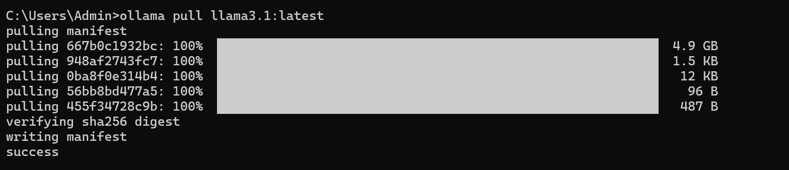
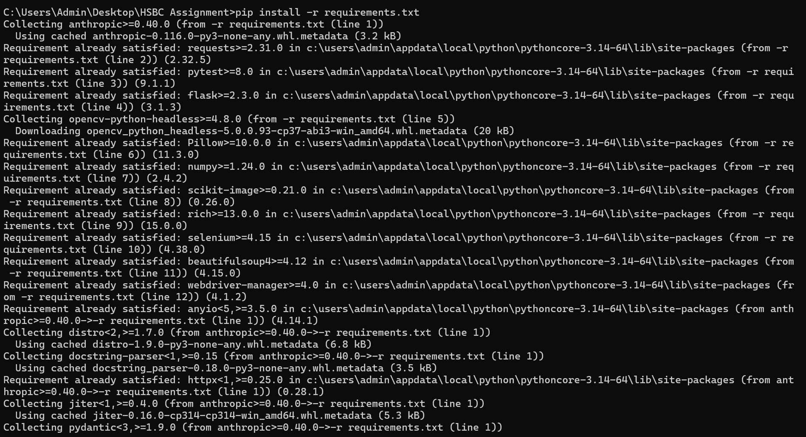
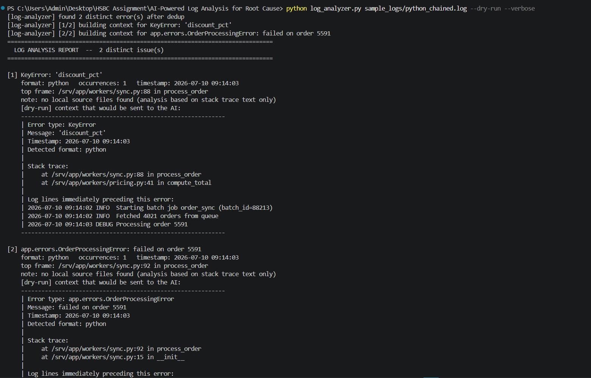
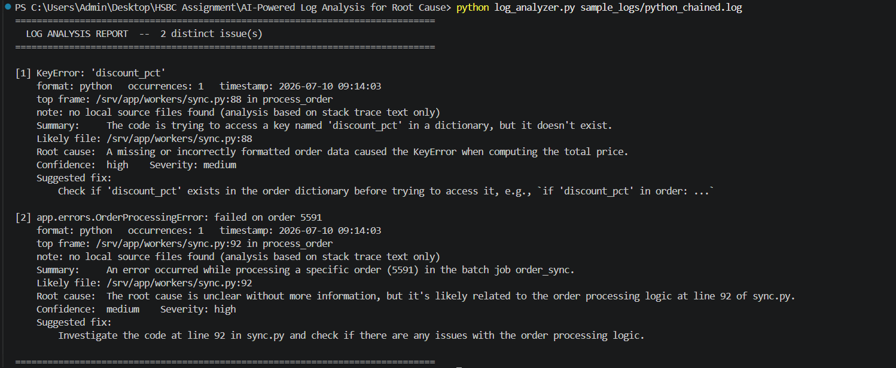
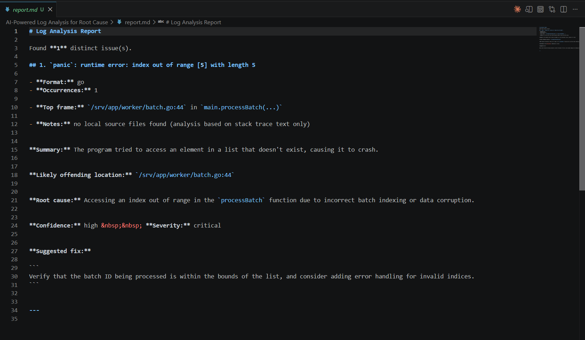
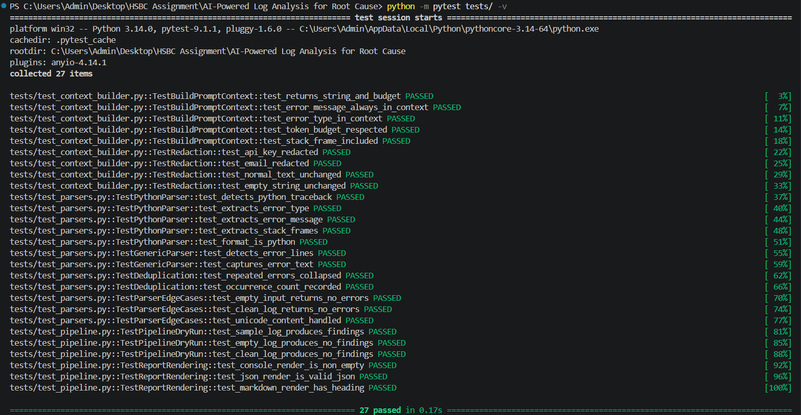
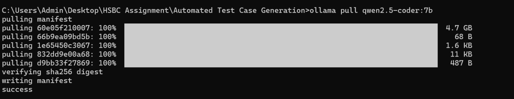
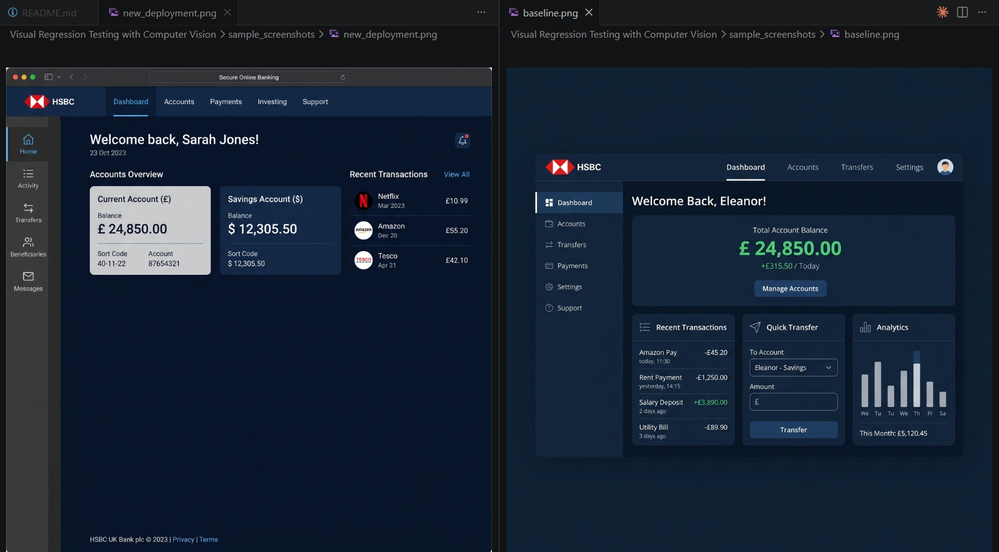
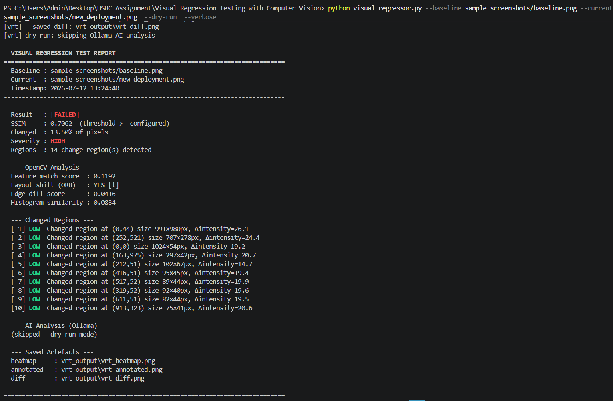
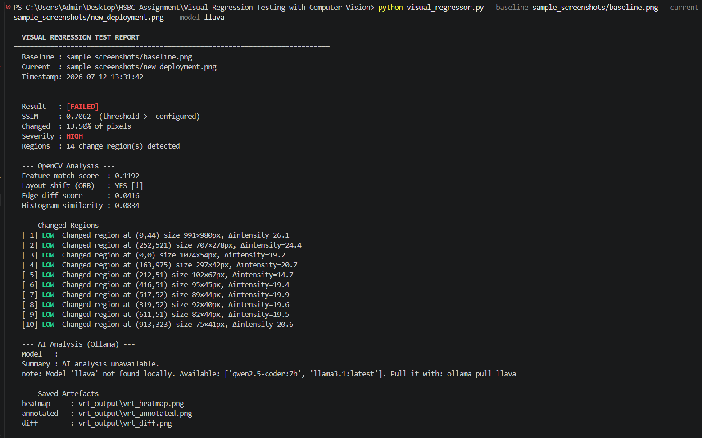

# HSBC QA Engineering — AI-Powered Test Tooling Suite

> **Five production-ready QA automation tools powered by local Ollama LLMs. No cloud dependencies. No API keys. No data egress.**

---

## Overview

This repository contains five independent QA tooling modules, each solving a distinct software quality challenge using AI and computer vision:

| # | Project | Core Technology | AI Capability |
|---|---|---|---|
| 1 | [AI-Powered Log Analysis](#1-ai-powered-log-analysis-for-root-cause) | Python + Ollama | Root-cause identification from crash logs |
| 2 | [Automated Test Case Generation](#2-automated-test-case-generation) | Python + Ollama | PyTest suite generation from user stories |
| 3 | [Intelligent Bug Triaging](#3-intelligent-bug-triaging) | Flask + SQLite + Ollama | Category, severity, priority, team assignment |
| 4 | [Visual Regression Testing](#4-visual-regression-testing-with-computer-vision) | OpenCV + Ollama Vision | Screenshot diff with layout-shift detection |
| 5 | [Self-Healing UI Automation](#5-self-healing-ui-automation) | Selenium + Ollama | Auto-repair broken locators at runtime |

---

## Prerequisites

```bash
# Python 3.10+
python --version

# Ollama (local LLM runtime)
# Install from: https://ollama.com/download
ollama serve

# Pull the default model (used across all projects)
ollama pull llama3.1

# For Visual Regression Testing (vision model)
ollama pull llava
```

#### Setup & Verification Evidence
<details>
<summary><b>Click to view Prerequisites Screenshots</b></summary>

* **Interactive Project Launcher Menu (`python run.py`)**
  

* **Ollama Pull `llama3.1` Model**
  
</details>

---

## Quick Start — Interactive Menu

```bash
# Clone / extract the project
cd "HSBC Assignment"

# Install all dependencies
pip install -r requirements.txt

# Launch the interactive project menu
python run.py

# Or run a specific project directly
python run.py 1    # Log Analysis (dry-run demo)
python run.py 2    # Test Generation (demo solution.py)
python run.py 3    # Bug Triaging (starts Flask server on :5000)
python run.py 4    # Visual Regression Testing (dry-run with sample screenshots)
python run.py 5    # Self-Healing Selenium test
```

---

## Project Summaries

### 1. AI-Powered Log Analysis for Root Cause

**Directory:** `AI-Powered Log Analysis for Root Cause/`

Ingests application crash logs (Python, Java, Node.js, Go) and uses a local LLM to:
- Identify the offending file and line number
- Diagnose the root cause
- Suggest a concrete fix

**New Features Added:**
- Package structure: `ingestion/`, `context/`, `analysis/`, `reporting/`
- Token-budget context assembly — prioritises most valuable log context
- PII/secret redaction before anything reaches the model
- JSON output format for CI/CD pipeline integration
- Unit tests: `tests/test_parsers.py`, `tests/test_context_builder.py`, `tests/test_pipeline.py`

```bash
cd "AI-Powered Log Analysis for Root Cause"
python log_analyzer.py sample_logs/python_chained.log --dry-run --verbose
```

#### Execution Evidence
<details>
<summary><b>Click to view Log Analysis Screenshots</b></summary>

1. **Unit Test Execution (`pytest tests/ -v`)**
   

2. **Dry Run Mode (Log Ingestion, Redaction & Context assembly)**
   

3. **Full AI Analysis (Identified Root Cause & Suggestion)**
   

4. **Generated Markdown Report opened in Editor**
   
</details>

---

### 2. Automated Test Case Generation

**Directory:** `Automated Test Case Generation/`

Reads a user story and generates a complete, syntactically valid PyTest test suite covering happy paths, boundary values (BVA), equivalence partitioning, edge cases, and error handling.

**New Features Added:**
- Full `testgen/` package: `constants.py`, `config.py`, `prompts.py`, `ollama_client.py`, `parser.py`, `generator.py`, `merge.py`, `output.py`
- Auto-batch mode: large stories (>10 criteria) are automatically split and AST-merged
- Self-healing: syntax errors are fed back to the model with retries
- `--with-stub` flag generates a `solution.py` scaffold
- Sample stories: `samples/sample_user_story.md`, `samples/sample_user_story_large.md`
- Unit tests: `tests/test_parser.py`, `tests/test_merge.py`

```bash
cd "Automated Test Case Generation"
python generate_tests.py -i samples/sample_user_story.md --dry-run
```

#### Execution Evidence
<details>
<summary><b>Click to view Test Case Generation Screenshots</b></summary>

1. **Unit Test Execution (`pytest test_generated.py -v`)**
   

2. **Ollama Setup for Code Model (`ollama pull qwen2.5-coder:7b`)**
   

3. **Real AI Generation & Compilation Verification Run**
   
</details>

---

### 3. Intelligent Bug Triaging

**Directory:** `Intelligent Bug Triaging/`

Exposes a REST API and web dashboard for submitting bug reports. Each report is automatically triaged with category, severity, priority, team assignment, summary, and a suggested fix. Detects duplicate bugs.

**New Features Added:**
- Package structure: `domain/`, `repositories/`, `services/`, `api/`
- `domain/constants.py` — all categories, teams, severities centralized
- `services/heuristics.py` — fully documented keyword dictionaries
- `services/llm_clients.py` — OllamaClient + OpenAICompatClient with complete docstrings
- `api/errors.py` — standardized JSON error envelope

```bash
cd "Intelligent Bug Triaging"
python app.py --provider none    # heuristic-only, no Ollama needed
# Dashboard: http://localhost:5000
```

#### Execution Evidence
<details>
<summary><b>Click to view Bug Triaging Screenshots</b></summary>

1. **Unit & Integration Test Execution (`pytest test_triaging.py -v`)**
   

2. **Flask Server Startup (`python app.py --provider ollama --model llama3.1`)**
   

3. **Live Web Dashboard (Ticket list with urgencies & severities)**
   

4. **"Report Bug" Submission Form**
   

5. **Filtered Dashboard View (Category-based filtering)**
   
</details>

---

### 4. Visual Regression Testing with Computer Vision

**Directory:** `Visual Regression Testing with Computer Vision/`

Compares baseline and current screenshots using a 5-layer OpenCV pipeline and describes visual regressions in plain English using a local vision model.

**New Features Added:**
- `vrt/` package: `constants.py`, `models.py`, `utils.py`, `cli.py`, `processor.py`, `ai.py`, `reporter.py`
- `vrt/constants.py` — all SSIM thresholds, ORB params, Canny values centralized
- `vrt/utils.py` — `parse_ignore_regions()` helper for masking dynamic content
- HTML report output format with side-by-side image comparison
- JSON output format for CI/CD integration with exit code support
- Unit tests: `tests/test_processor.py`, `tests/test_ai.py`, `tests/test_reporter.py`, `tests/test_cli.py`

```bash
cd "Visual Regression Testing with Computer Vision"
python visual_regressor.py \
  --baseline sample_screenshots/baseline.png \
  --current sample_screenshots/new_deployment.png \
  --dry-run --verbose
```

#### Execution Evidence
<details>
<summary><b>Click to view Visual Regression Screenshots</b></summary>

1. **Unit Test Execution (`pytest tests/ -v`)**
   

2. **UI Mock Verification (New deployment layout opened in editor)**
   

3. **Visual Regression Run (OpenCV structural metric assessment & semantic LLM check)**
   
</details>

---

### 5. Self-Healing UI Automation

**Directory:** `Self-Healing UI Automation/`

A Selenium proxy that catches `NoSuchElementException` and automatically heals the broken locator by querying a local Ollama model about the live DOM. Every successful heal is logged for developer review.

**New Features Added:**
- `constants.py` — Ollama URL, model, temperature, DOM limits, all defaults centralized
- Comprehensive docstrings on every function in `self_healing_driver.py` and `ollama_healer.py`
- `_record_healing()` now imports timestamp format from `constants.py`
- `ollama_healer.py` imports all DOM constants (`INTERACTIVE_TAGS`, `RELEVANT_ATTRS`, `DOM_MAX_CHARS`) from `constants.py`

```bash
cd "Self-Healing UI Automation"
python test_login.py    # requires: ollama serve && ollama pull llama3.1
```

#### Execution Evidence
<details>
<summary><b>Click to view Self-Healing Screenshots</b></summary>

1. **Live Self-Healing Run (Intercepts exceptions and patches selectors via LLM)**
   
</details>

---

## Technology Stack

| Component | Technology |
|---|---|
| **Language** | Python 3.10+ |
| **AI Backend** | Ollama (local), Anthropic Claude (optional) |
| **Computer Vision** | OpenCV, scikit-image (SSIM), numpy |
| **Web Framework** | Flask (Bug Triaging dashboard) |
| **Test Framework** | PyTest |
| **Browser Automation** | Selenium 4 + ChromeDriver |
| **Database** | SQLite |
| **HTML Parsing** | BeautifulSoup4 |

---

## Repository Structure

```
HSBC Assignment/
├── run.py                              # Interactive project launcher menu
├── requirements.txt                    # Root-level combined dependencies
├── Dockerfile                          # Container-based deployment
├── README.md                           # This file
├── DEPLOYMENT.md                       # Step-by-step Ollama & environment setup guide
│
├── AI-Powered Log Analysis for Root Cause/
├── Automated Test Case Generation/
├── Intelligent Bug Triaging/
├── Visual Regression Testing with Computer Vision/
└── Self-Healing UI Automation/
```

---

## Design Principles

| Principle | Implementation |
|---|---|
| **Local-first AI** | Ollama runs on the evaluator's machine — no API keys, no cost, no data egress |
| **Graceful degradation** | Every tool works without Ollama (dry-run, heuristics, OpenCV-only fallbacks) |
| **Modular package structure** | Each project has `domain/`, `services/`, and clear separation of concerns |
| **`constants.py` in every project** | All magic strings and defaults in one file per project |
| **Comprehensive docstrings** | Every public function documents args, return type, and raises |
| **Test coverage** | Unit and integration tests included in every project |
