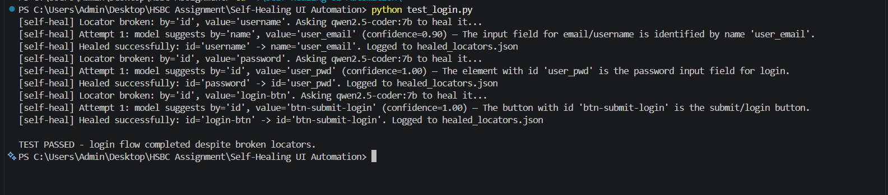

# Self-Healing UI Automation

> **Selenium test automation that never breaks on locator changes — when `NoSuchElementException` is thrown, a local Ollama model inspects the live DOM and suggests a replacement locator automatically.**

---

## What It Does

Wraps a Selenium `WebDriver` with a transparent proxy that:

1. **Intercepts** `NoSuchElementException` on any `find_element` call
2. **Simplifies** the live page DOM to a compact JSON list (inputs, buttons, links only)
3. **Queries** a local Ollama model with the broken locator + DOM context + element description
4. **Tries** the suggested replacement locator — up to 2 attempts with different suggestions
5. **Caches** the successful heal in-memory so subsequent calls to the same locator don't hit the model again
6. **Logs** every successful heal to `healed_locators.json` with a ready-to-paste code fix

The result: tests continue to pass through page refactors, ID renames, and DOM restructuring — and you get an audit trail telling you exactly what to fix in the test source.

---

## Architecture

```
test_login.py
     │
     │  healing.find_element("id", "username", description="email input")
     ▼
┌──────────────────────────────────────────────────────────┐
│   SelfHealingDriver (self_healing_driver.py)             │
│                                                          │
│   1. Check in-memory cache → return cached locator       │
│   2. Try driver.find_element() → success → return        │
│   3. NoSuchElementException caught                       │
│                                                          │
│   ┌──────────────────────────────────────────────────┐   │
│   │  Healing Loop (max 2 attempts)                   │   │
│   │                                                  │   │
│   │  simplify_dom(page_source)  ← strips to JSON     │   │
│   │       ↓                                          │   │
│   │  build_prompt(old_locator, DOM, description)     │   │
│   │       ↓                                          │   │
│   │  POST /api/generate (Ollama)                     │   │
│   │       ↓                                          │   │
│   │  {"by":"id","value":"user_email","confidence":…} │   │
│   │       ↓                                          │   │
│   │  driver.find_element(By.ID, "user_email")        │   │
│   │       ↓ success                                  │   │
│   │  Cache it + Log to healed_locators.json          │   │
│   └──────────────────────────────────────────────────┘   │
└──────────────────────────────────────────────────────────┘
     │
     ▼
  WebElement (same as standard Selenium)
```

---

## Quick Start

```bash
# 1. Start Ollama
ollama serve
ollama pull llama3.1

# 2. Install dependencies
pip install -r requirements.txt

# 3. Run the demo test (uses intentionally broken locators)
python test_login.py

# Expected output:
# [self-heal] Locator broken: by='id', value='username'. Asking llama3.1 to heal it...
# [self-heal] Attempt 1: model suggests by='id', value='user_email' (confidence=0.95)
# [self-heal] Healed successfully: id='username' -> id='user_email'. Logged to healed_locators.json
# ...
# TEST PASSED - login flow completed despite broken locators.
```

---

## Integrating into Your Own Tests

```python
from selenium import webdriver
from self_healing_driver import SelfHealingDriver

driver = webdriver.Chrome()
healing = SelfHealingDriver(driver, model="llama3.1", verbose=True)

# Use healing.find_element() instead of driver.find_element()
# Locator strategies: "id", "name", "css", "xpath", "link_text", "class_name"
email_field = healing.find_element(
    "id", "email",
    description="the email/username input field for login"
)
email_field.send_keys("user@example.com")

password_field = healing.find_element(
    "id", "password",
    description="the password input field"
)
password_field.send_keys("s3cur3P@ss")

login_btn = healing.find_element(
    "id", "login-btn",
    description="the submit/login button"
)
login_btn.click()
```

---

## healed_locators.json — Audit Trail

Every successful heal is appended to `healed_locators.json`:

```json
[
  {
    "timestamp": "2024-01-15 14:30:22",
    "old_locator": {"by": "id", "value": "username"},
    "new_locator": {"by": "id", "value": "user_email"},
    "confidence": 0.95,
    "reasoning": "The element with id='user_email' is an email input field matching the description.",
    "suggested_code_fix": "By.ID, \"user_email\"  # was By.ID, \"username\""
  }
]
```

Use this file to update your test source directly — the `suggested_code_fix` field is ready to paste.

---

## Project Structure

```
Self-Healing UI Automation/
├── self_healing_driver.py   # SelfHealingDriver proxy class
├── ollama_healer.py         # DOM simplification + Ollama client + prompt building
├── constants.py             # ALL magic strings and defaults (NEW)
├── test_login.py            # Demo test with intentionally broken locators
├── test_page.html           # Demo HTML page with updated element IDs
├── requirements.txt
└── README.md
```

---

## constants.py — Configuration Hub

All tuneable values are in `constants.py`:

```python
OLLAMA_BASE_URL       = "http://localhost:11434"   # Ollama server
DEFAULT_OLLAMA_MODEL  = "llama3.1"                 # Model for healing
MAX_HEAL_ATTEMPTS     = 2                          # Retries before giving up
LLM_TEMPERATURE       = 0.2                        # Low = deterministic
DOM_MAX_CHARS         = 6_000                      # DOM snapshot size limit
```

---

## CLI / Environment Options

| Variable / Flag | Default | Description |
|---|---|---|
| `OLLAMA_MODEL` env var | `llama3.1` | Override model without changing code |
| `model=` constructor arg | `llama3.1` | Set per-driver-instance |
| `verbose=` constructor arg | `True` | Enable/disable `[self-heal]` logging |
| `MAX_HEAL_ATTEMPTS` in `constants.py` | `2` | Max healing attempts before `LocatorHealingError` |

---

## Key Enhancement Features

| Feature | Description |
|---|---|
| **Multi-attempt healing** | Up to `MAX_HEAL_ATTEMPTS` suggestions; model is told about each failed attempt to avoid repetition |
| **In-session caching** | Same locator healed once per session — subsequent calls use cached result instantly |
| **`healed_locators.json`** | Persistent audit log with ready-to-paste code fixes for developers |
| **Confidence scoring** | Model reports its own confidence (0.0–1.0) — logged for triaging quality of heals |
| **`constants.py`** | All Ollama URL, model, temperature, DOM limits in one file |
| **Compact DOM** | Only interactive tags and relevant attributes sent to model — stays within context limits |
| **Plain-string strategies** | Uses `"id"`, `"css"` etc. (not `By.ID`) — loggable, cacheable, model-compatible |

---

## How It Works Internally

### DOM Simplification

Instead of sending the full 50,000-character page source to the LLM (which would exceed most models' context windows), `simplify_dom()` strips it to a compact JSON array:

```json
[
  {"tag": "input", "attrs": {"id": "user_email", "type": "email", "placeholder": "Email"}, "text": ""},
  {"tag": "input", "attrs": {"id": "user_pwd", "type": "password"}, "text": ""},
  {"tag": "button", "attrs": {"id": "btn-submit-login"}, "text": "Sign In"}
]
```

This keeps the prompt under 6,000 characters regardless of page complexity.

### Model Prompt

The model receives:
```
Broken locator: strategy="id", value="username"
Element purpose/description: the email/username input field for login

Current DOM interactive elements (JSON array):
[{"tag": "input", "attrs": {"id": "user_email", "type": "email"}, ...}]

Return the healed locator JSON now.
```

---

## Troubleshooting

| Symptom | Fix |
|---|---|
| `LocatorHealingError` after 2 attempts | The page DOM may be too dynamic; add a `description=` argument to improve model accuracy |
| `RuntimeError: Could not reach Ollama` | Run `ollama serve` and `ollama pull llama3.1` |
| Model suggests wrong element repeatedly | Try a larger model (`llama3.1` instead of `llama3.2:3b`) |
| `healed_locators.json` not created | Check write permissions in the script directory |
| ChromeDriver not found | Install: `pip install webdriver-manager` or set `CHROMEDRIVER_PATH` |

---

## Extending the Healer

### Use a different model per-environment

```python
import os
model = os.environ.get("OLLAMA_MODEL", "llama3.1")
healing = SelfHealingDriver(driver, model=model)
```

### Disable verbose logging in CI

```python
healing = SelfHealingDriver(driver, verbose=False)
```

### Increase healing attempts for flaky pages

Edit `constants.py`:
```python
MAX_HEAL_ATTEMPTS = 3
```

---

## Execution Evidence

1. **Live Self-Healing Run (Intercepts exceptions and patches selectors via LLM)**
   
